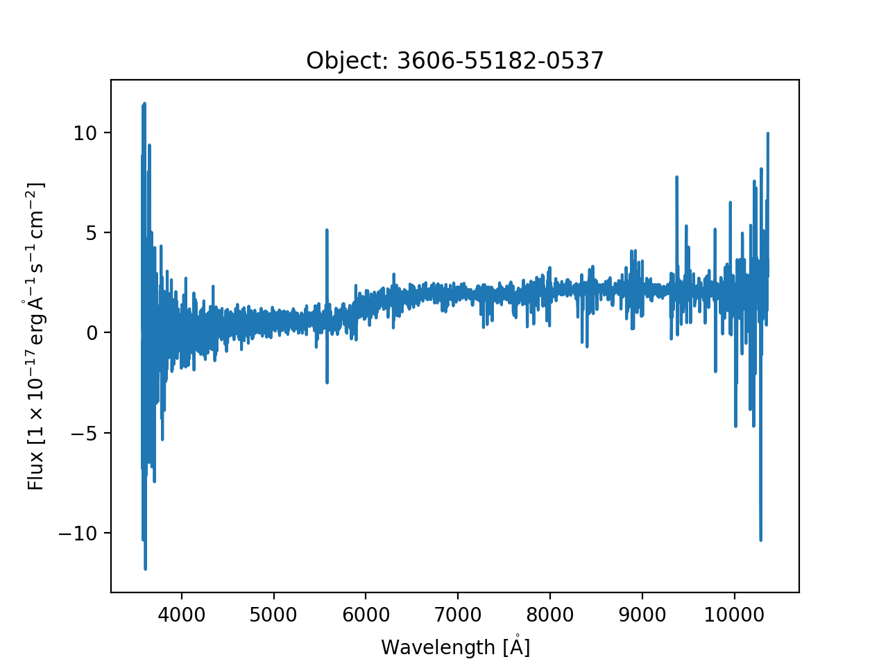

.. _tools:

Convenience Tools
-----------------

`sdss_brain` offers starter tools, based off the ``Brain``, that can be further customized and subclassed
to enable enhancements specific to the science domain.

Spectral Data
^^^^^^^^^^^^^

For spectral data, the ``Spectrum`` helper class exists that loads underlying spectral data.  A few starter
tools are currently available for SDSS spectral data.  Available sub-tools are:

- `~sdss_brain.tools.spectra.Eboss`:  single fiber SDSS BOSS / EBOSS spectra
- `~sdss_brain.tools.cubes.MangaCube`: SDSS Manga IFU data cubes
- `~sdss_brain.tools.spectra.ApStar`: SDSS APOGEE-2 combined spectra for a single star
- `~sdss_brain.tools.spectra.ApVisit`: SDSS APOGEE-2 single visit spectra for a given star
- `~sdss_brain.tools.spectra.AspcapStar`: SDSS APOGEE-2 combined stellar spectra with ASPCAP results

Let's load a single fiber EBOSS spectrum
from plate **3606**, mjd **55182**, fiber **0537** from the DR14 public data release.
::

    >>> # load a single fiber Eboss spectrum
    >>> from sdss_brain.tools import Eboss

    >>> objid = '3606-55182-0537'
    >>> e = Eboss(objid, release='DR14')
    >>> e
    <Eboss objectid='3606-55182-0537', mode='local', data_origin='file', lite=True>

If the data has been loaded from a file, the full `~astropy.io.fits.HDUList` is available as the ``data`` attribute.
The FITS header also gets loaded into a ``header`` attribute.
::

    >>> # display the FITS data and header
    >>> e.data.info()
    Filename: /Users/Brian/Work/sdss/sas/dr14/eboss/spectro/redux/v5_10_0/spectra/lite/3606/spec-3606-55182-0537.fits
    No.    Name      Ver    Type      Cards   Dimensions   Format
    0  PRIMARY       1 PrimaryHDU     125   ()
    1  COADD         1 BinTableHDU     26   4626R x 8C   [E, E, E, J, J, E, E, E]
    2  SPALL         1 BinTableHDU    488   1R x 236C   [27A, 14A, 4A, E, E, J, J, E, J, E, E, E, K, K, K, K, K, K, K, K, K, B, B, J, I, 5E, 5E, J, J, J, J, 7A, 7A, 16A, D, D, 6A, 21A, E, E, E, J, E, 24A, 10J, J, 10E, E, E, E, E, E, E, J, E, E, E, J, 5E, E, E, 10E, 10E, 10E, 5E, 5E, 5E, 5E, 5E, J, J, E, E, E, E, E, E, 16A, 9A, 12A, E, E, E, E, E, E, E, E, J, E, E, J, J, 6A, 21A, E, 35E, K, 19A, 19A, 19A, B, B, B, I, 3A, B, I, I, I, I, J, E, J, J, E, E, E, E, E, E, E, E, 5E, 5E, 5E, 5E, 5E, 5E, 5E, 5E, 5E, 5E, 5E, 5E, 5E, 5E, 5E, 5E, 5E, 5E, 5E, 5E, 5E, 5E, 5E, 5E, 5E, 5E, 5E, 5E, 5E, 5E, 5E, 5E, 5E, 5E, 5E, 5J, 5J, 5J, 5E, 5J, 75E, 75E, 5E, 5E, 5E, 5J, 5E, D, D, D, D, D, D, D, D, D, 5E, 5E, 5E, 5E, 5E, 5E, 5E, 5E, 5E, 5E, 5E, 5E, 5E, 5E, 5E, 5E, 5E, 5E, 5E, 5E, 5E, 5E, 5E, 5E, 5E, 5E, 5E, 5E, 5E, 5E, 5E, 5E, 5E, 5E, 5E, 5E, 5E, 5E, 5E, 5E, 5E, 5E, 40E, 40E, 5J, 5J, 5E, 5E, 5D, J, J, J, J, J, J, J, E]
    3  SPZLINE       1 BinTableHDU     48   32R x 19C   [J, J, J, 13A, D, E, E, E, E, E, E, E, E, E, E, J, J, E, E]

    >>> e.header
    SIMPLE  =                    T / conforms to FITS standard
    BITPIX  =                    8 / array data type
    NAXIS   =                    0 / number of array dimensions
    EXTEND  =                    T
    TELESCOP= 'SDSS 2.5-M'         / Sloan Digital Sky Survey
    FLAVOR  = 'science '           / exposure type, SDSS spectro style
    BOSSVER = 'branch_jme-rewrite+svn105958' / ICC version
    MJD     =                55182 / APO MJD day at start of exposure
    MJDLIST = '55181 55182'        /
    RA      =            28.001011 / RA of telescope boresight (deg)
    DEC     =             0.000273 / Dec of telescope boresight (deg)
    ...

The class has built-in support for spectral data using
`specutils <https://specutils.readthedocs.io/en/stable/i>`_.  If ``specutils`` supports the specific file
format, it automatically reads in the data to a `~specutils.Spectrum1D` object, which is a fully represented
``NDData`` object.  See the `specutils <https://specutils.readthedocs.io/en/stable/i>`_ documentation
for more information on what you can do with a ``Spectrum1D`` object.
::

    >>> # access the spectrum1D data
    >>> e.spectrum
    <Spectrum1D(flux=<Quantity [-1.3572823 , -0.40395638, -6.811142  , ...,  3.6619325 ,
            2.775676  ,  9.941529  ] 1e-17 erg / (Angstrom cm2 s)>, spectral_axis=<SpectralCoord [ 3572.7283,  3573.552 ,  3574.374 , ..., 10358.569 ,
                10360.958 , 10363.348 ] Angstrom,
	radial_velocity=0.0 km / s,
	redshift=0.0,
	doppler_rest=0.0 Angstrom,
	doppler_convention=None,
	observer=None,
	target=None>, uncertainty=StdDevUncertainty([6.29442  , 6.3023944, 6.259549 , ..., 4.1046424,
                   3.6570566, 3.1807606]))>

The ``Spectrum`` lets you quickly plot a spectrum to display as a matplotlib plot.
::

    # plot the spectrum object
    e.plot()

Currently there is no SDSS API yet.  However, all tools work remotely by using
`~sdss_brain.helpers.io.load_from_url`, a function that streams the file via an HTTP get request and loads
its contents into an in-memory FITS object.  Let's load a different EBOSS spectral fiber, **550**, one
that we may not have locally.
::

    >>> # load eboss fiber 550 remotely
    >>> e = Eboss('3606-55182-0550', release='DR14')
    >>> e
    <Eboss objectid='3606-55182-0550', mode='remote', data_origin='api', lite=True>

    >>> e.spectrum
    <Spectrum1D(flux=<Quantity [ 8.872343  ,  0.41632798, -4.9438033 , ...,  1.0025655 ,
            -1.176005  ,  8.128782  ] 1e-17 erg / (Angstrom cm2 s)>, spectral_axis=<SpectralAxis [ 3571.9065,  3572.7283,  3573.552 , ..., 10358.569 , 10360.958 ,
    10363.348 ] Angstrom>, uncertainty=InverseVariance([0.00840226, 0.01222116, 0.01264216, ..., 0.04095282,
                    0.05368033, 0.06472613]))>

Context Managers
^^^^^^^^^^^^^^^^

The ``Brain`` and all subclasses open FITS data and make it directly accessible via the ``data`` attribute.
Each tool or ``Brain`` subclass comes with a destructor method that should safely close any open files,
database connections, or remote request sessions.  Alternatively you can use each tool as a contextmanager.
::

    with Eboss(s, release='DR14') as e:
        spectrum = e.spectrum